# 目录
* [音频](#音频)
* [密码](#密码)
* [客户端-服务器](#客户端-服务器)
* [进制与转换](#进制与转换)
* [数据结构](#数据结构)
* [开发者工具](#开发者工具)
* [动态规划](#动态规划)
* [贪心算法](#贪心算法)
* [进程调度算法](#进程调度算法)
* [搜索算法](#搜索算法)
* [排序算法](#排序算法)
* [哈希](#哈希)
* [数学](#数学)
* [几何学](#几何学)
* [图形](#图形)
* [数值方法](#数值方法)
* [机器学习](#机器学习)
* [其他](#其他)
* [数学和计算机科学问题集锦](#数学和计算机科学问题集锦)
* [在线编程平台exercism](#在线编程平台)

## 音频
### [音频压缩算法A-law](./audio/alaw.c)

A-Law的编码公式如下:

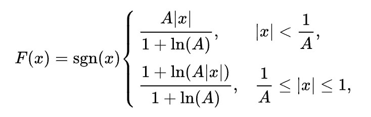


其中x为输入,F(x)为编码结果,A为压缩参数一般取值为87.6

A-Law解码公式,也就上述函数的反函数如下:

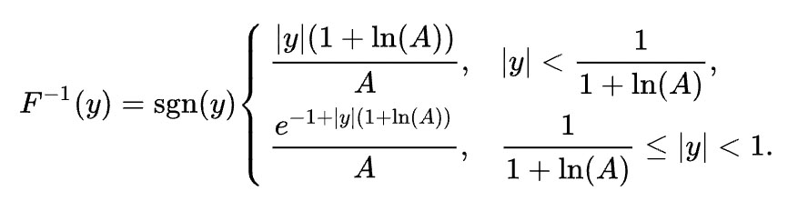

其中y为上述函数的结果编码


## 密码
### [加密算法Affine](./cipher/affine.c)
仿射同态加密(Affine Homomorphic Encryption)，通过映射来进行加密，仿射加密是线性变换，对字符型变量，可以将其映射为数值型变量

#### 1、计算过程

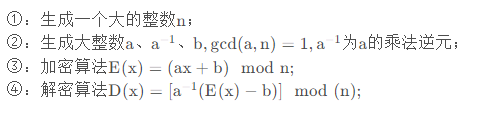

#### 2、示例

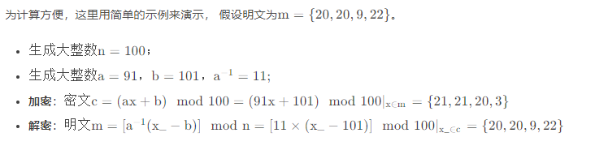


### [加密算法Rot13](./cipher/rot13.c)

ROT13（回转13位，rotate by 13 places）是一种简易的替换式密码。它是一种在英文网络论坛用作隐藏八卦（spoiler）、妙句、谜题解答以及某些脏话的工具，目的是逃过版主或管理员的匆匆一瞥。

ROT13是它自身的逆反，即：要还原成原文只要使用同一算法即可得，故同样的操作可用于加密与解密。该算法并没有提供真正密码学上的保全，故它不应该被用于需要保全的用途上。它常常被当作弱加密示例的典型。

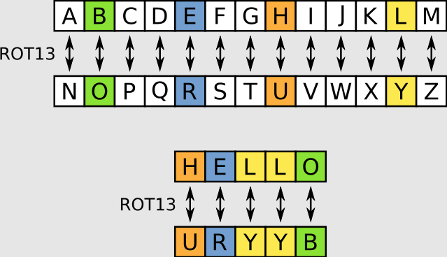

## 客户端-服务器

### TCP

#### [server-client](./client_server/tcp_client_server/)

TCP是一个传输层协议，提供可靠传输，支持全双工，是一个连接导向的协议。Socket是TCP / IP协议族 的编程接口（API）。


单工：
        在任何一个时刻，如果数据只能单向发送，就是单工。

#### [tcp_half_duplex](./client_server/tcp_half_duplex/)

半双工：
        如果在某个时刻数据可以向一个方向传输，也可以向另一个方向反方向传输，而且交替进行，叫作半双工；半双工需要至少 1 条线路。


#### [tcp_full_duplex](./client_server/tcp_full_duplex/)
全双工：
        如果任何时刻数据都可以双向收发，这就是全双工，全双工需要大于 1 条线路。
        
        TCP 是一个双工协议，数据任何时候都可以双向传输。这就意味着客户端和服务端可以平等地发送、接收信息。


「第一次握手」：

客户端将TCP报文标志位SYN置为1，随机产生一个序号值seq=J，保存在TCP首部的序列号字段里，指明客户端打算连接的服务器的端口，并将该数据包发送给服务器端，发送完毕后，客户端进入SYN_SENT状态，等待服务器端确认。

「第二次握手」：

服务器端收到数据包后由标志位SYN=1知道客户端请求建立连接，服务器端将TCP报文标志位SYN和ACK都置为1，ack=J+1，随机产生一个序号值seq=K，并将该数据包发送给客户端以确认连接请求，服务器端进入SYN_RCVD状态。

「第三次握手」：

客户端收到确认后，检查ack是否为J+1，ACK是否为1，如果正确则将标志位ACK置为1，ack=K+1，并将该数据包发送给服务器端，服务器端检查ack是否为K+1，ACK是否为1，如果正确则连接建立成功，客户端和服务器端进入ESTABLISHED状态，完成三次握手，随后客户端与服务器端之间可以开始传输数据了。

「上面写的ack和ACK，不是同一个概念：」

小写的ack代表的是头部的确认号Acknowledge number， 缩写ack，是对上一个包的序号进行确认的号，ack=seq+1。
大写的ACK，则是我们上面说的TCP首部的标志位，用于标志的TCP包是否对上一个包进行了确认操作，如果确认了，则把ACK标志位设置成1。

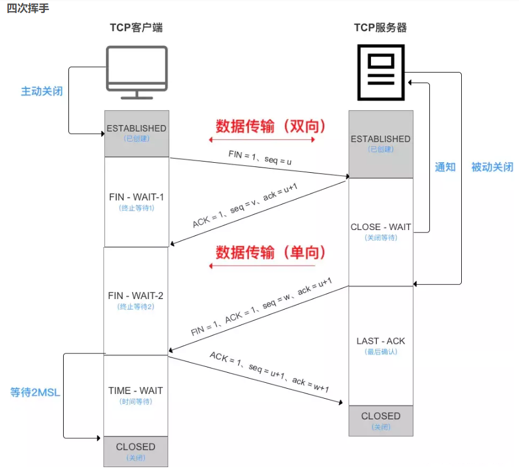

挥手请求可以是Client端，也可以是Server端发起的，我们假设是Client端发起：

第一次挥手：Client端发起挥手请求，向Server端发送标志位是FIN报文段，设置序列号seq，此时，Client端进入FIN_WAIT_1状态，这表示Client端没有数据要发送给Server端了。
第二次挥手：Server端收到了Client端发送的FIN报文段，向Client端返回一个标志位是ACK的报文段，ack设为seq加1，Client端进入FIN_WAIT_2状态，Server端告诉Client端，我确认并同意你的关闭请求。
第三次挥手：Server端向Client端发送标志位是FIN的报文段，请求关闭连接，同时Client端进入LAST_ACK状态。
第四次挥手 ：Client端收到Server端发送的FIN报文段，向Server端发送标志位是ACK的报文段，然后Client端进入TIME_WAIT状态，Server端收到Client端的ACK报文段以后，就关闭连接，此时，Client端等待2MSL的时间后依然没有收到回复，则证明Server端已正常关闭，那好，Client端也可以关闭连接了。

### UDP

#### [udp_client_server](./client_server/udp_client_server/)

UDP（user datagram protocol）的中文叫用户数据报协议，属于传输层。UDP是面向非连接的协议，它不与对方建立连接，而是直接把我要发的数据报发给对方。所以UDP适用于一次传输数据量很少、对可靠性要求不高的或对实时性要求高的应用场景。正因为UDP无需建立类如三次握手的连接，而使得通信效率很高。

UDP的应用非常广泛，比如一些知名的应用层协议（SNMP、DNS）都是基于UDP的，想一想，如果SNMP使用的是TCP的话，每次查询请求都得进行三次握手，这个花费的时间估计是使用者不能忍受的，因为这会产生明显的卡顿。所以UDP就是SNMP的一个很好的选择了，要是查询过程发生丢包错包也没关系的，我们再发起一个查询就好了，因为丢包的情况不多，这样总比每次查询都卡顿一下更容易让人接受吧。

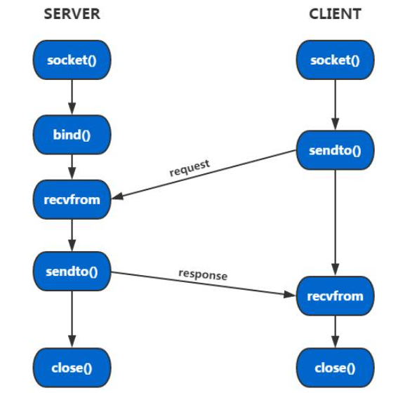

#### [remote_command_exec_udp](./client_server/udp_remote_command_exec/)

 * 该算法基于简单的UDP客户端和服务器模型。它运行一个无限循环，获取用户输入并将其发送到服务器
 * 来执行。服务器接收命令并执行它们直到用户退出循环
 * 通过这种方式，远程命令执行，使用UDP显示
 * 使用服务器-客户端模型和套接字编程


## 进制与转换

### [二进制 转 十进制](./conversions/binary_to_decimal.c)
```c
#include <stdio.h>

int main()
{
    int remainder, number = 0, decimal_number = 0, temp = 1;
    printf("\n Enter any binary number= ");
    scanf("%d", &number);

    // Iterate over the number until the end.
    while (number > 0)
    {
        remainder = number % 10;
        number = number / 10;
        decimal_number += remainder * temp;
        temp = temp * 2;  // used as power of 2
    }

    printf("%d\n", decimal_number);
}
```

### [二进制 转 十六进制](./conversions/binary_to_hexadecimal.c)
```c
#include <stdio.h>

int main()
{
    long int binary, hexa = 0, i = 1, remainder;

    printf("Enter the binary number: ");
    scanf("%ld", &binary);
    while (binary != 0)
    {
        remainder = binary % 10;
        hexa = hexa + remainder * i;
        i = i * 2;
        binary = binary / 10;
    }
    printf("The equivalent hexadecimal value: %lX", hexa);
    return 0;
}
```

### [二进制 转 八进制](./conversions/binary_to_octal.c)
```c
// Binary number to octal number conversion
#include <stdio.h>

// Function that returns the last three digits
int three_digits(int n)
{
    int r, d = 0, p = 1;

    for (int i = 0; i < 3; i++)
    {
        r = n % 10;
        d += r * p;
        p *= 10;
        n /= 10;
    }
    return d;
}

int main(void)
{
    int binary_num, d = 0, base = 1, remainder, td, res = 0, ord = 1;

    printf("Enter the binary no: ");
    scanf("%d", &binary_num);

    while (binary_num > 0)
    {
        if (binary_num >
            111)  // Checking if binary number is greater than three digits
            td = three_digits(binary_num);

        else
            td = binary_num;

        binary_num /= 1000;

        d = 0, base = 1;

        // Converting the last three digits to decimal
        while (td > 0)
        {
            remainder = td % 10;
            td /= 10;
            d += (base * remainder);
            base *= 2;
        }

        res += d * ord;  // Calculating the octal value
        ord *= 10;
    }

    printf("\nOctal equivalent is: %d", res);
    return 0;
}

```

### [十进制 转 任意进制](./conversions/decimal_to_any_base.c)
```c
static void test()
{
	char* ret = NULL;
	char* reference = NULL;

	/* min dec*/
	reference = "0";
	ret = decimal_to_anybase(0, "0123456789");
	for (int i = 0; i < strlen(reference) && i < strlen(ret); i++) {
		assert(ret[i] == reference[i]);
	}
	if (ret != NULL) {
		free(ret);
	}
	
	/* max dec*/
	reference = "18446744073709551615";
	ret = decimal_to_anybase(18446744073709551615, "0123456789");
	for (int i = 0; i < strlen(reference) && i < strlen(ret); i++) {
		assert(ret[i] == reference[i]);
	}
	if (ret != NULL) {
		free(ret);
	}
	
	/* negative dec*/
	reference = "18446744073709551615";
	ret = decimal_to_anybase(-1, "0123456789");
	for (int i = 0; i < strlen(reference) && i < strlen(ret); i++) {
		assert(ret[i] == reference[i]);
	}
	if (ret != NULL) {
		free(ret);
	}

	/* bin */
	reference = "101010";
	ret = decimal_to_anybase(42, "01");
	for (int i = 0; i < strlen(reference) && i < strlen(ret); i++) {
		assert(ret[i] == reference[i]);
	}
	if (ret != NULL) {
		free(ret);
	}
	
	/* octal */
	reference = "52";
	ret = decimal_to_anybase(42, "01234567");
	for (int i = 0; i < strlen(reference) && i < strlen(ret); i++) {
		assert(ret[i] == reference[i]);
	}
	if (ret != NULL) {
		free(ret);
	}
	
	/* hexa */
	reference = "2A";
	ret = decimal_to_anybase(42, "0123456789ABCDEF");
	for (int i = 0; i < strlen(reference) && i < strlen(ret); i++) {
		assert(ret[i] == reference[i]);
	}
	if (ret != NULL) {
		free(ret);
	}
	printf("[+] All tests have successfully passed!\n");
}
```

### [十进制 转 二进制](./conversions/decimal_to_binary.c)
```c
#include <stdio.h>
#include <stdlib.h>

#define MAXBITS 100

int main()
{
    // input of the user
    int inputNumber;

    // for the remainder
    int re;

    // contains the bits 0/1
    int bits[MAXBITS];

    // for the loops
    int j;
    int i = 0;

    printf("\t\tConverter decimal --> binary\n\n");

    // reads a decimal number from the user.
    printf("\nenter a positive integer number: ");
    scanf("%d", &inputNumber);

    // make sure the input number is a positive integer.
    if (inputNumber < 0)
    {
        printf("only positive integers >= 0\n");
        return 1;
    }

    // actual processing
    while (inputNumber > 0)
    {
        // computes the remainder by modulo 2
        re = inputNumber % 2;

        // computes the quotient of division by 2
        inputNumber = inputNumber / 2;

        bits[i] = re;
        i++;
    }

    printf("\n the number in binary is: ");

    // iterates backwards over all bits
    for (j = i - 1; j >= 0; j--)
    {
        printf("%d", bits[j]);
    }

    // for the case the input number is 0
    if (i == 0)
    {
        printf("0");
    }

    return 0;
}

```

### [十进制 转 二进制递归](./conversions/decimal_to_binary_recursion.c)
```c
int decimal_to_binary(unsigned int number)
{
    return number == 0 ? 0 : number % 2 + 10 * decimal_to_binary(number / 2);
}

/** Test function */
void test()
{
    const int sets[][2] = {
        {0, 0}, {1, 1}, {2, 10}, {3, 11}, {4, 100}, {6, 110}, {7, 111},
        /* add more data sets to test */
    };

    for (int i = 0, size = sizeof(sets) / sizeof(sets[0]); i < size; ++i)
    {
        assert(decimal_to_binary(sets[i][0]) == sets[i][1]);
    }
}
```

### [十进制 转 十六进制](./conversions/decimal_to_hexa.c)
```c
#include <stdio.h>
void decimal2Hexadecimal(long num);

int main()
{
    long decimalnum;

    printf("Enter decimal number: ");
    scanf("%ld", &decimalnum);

    decimal2Hexadecimal(decimalnum);

    return 0;
}

/********function for convert decimal number to hexadecimal
 * number****************/
void decimal2Hexadecimal(long num)
{
    long decimalnum = num;
    long quotient, remainder;
    int i, j = 0;
    char hexadecimalnum[100];

    quotient = decimalnum;

    while (quotient != 0)
    {
        remainder = quotient % 16;
        if (remainder < 10)
            hexadecimalnum[j++] = 48 + remainder;

        else
            hexadecimalnum[j++] = 55 + remainder;

        quotient = quotient / 16;
    }

    // print the hexadecimal number

    for (i = j; i >= 0; i--)
    {
        printf("%c", hexadecimalnum[i]);
    }

    printf("\n");
}
```

### [十进制 转 八进制](./conversions/decimal_to_octal.c)
```c
#include <stdio.h>
void decimal2Octal(long decimalnum);

int main()
{
    long decimalnum;

    printf("Enter the decimal number: ");
    scanf("%ld", &decimalnum);

    decimal2Octal(decimalnum);

    return 0;
}

/********function for convert decimal numbers to octal numbers************/
void decimal2Octal(long decimalnum)
{
    long remainder, quotient;

    int octalNumber[100], i = 1, j;
    quotient = decimalnum;

    while (quotient != 0)
    {
        octalNumber[i++] = quotient % 8;

        quotient = quotient / 8;
    }

    for (j = i - 1; j > 0; j--) printf("%d", octalNumber[j]);

    printf("\n");
}
```

### [十进制 转 八进制递归](./conversions/decimal_to_octal_recursion.c)
```c
#include <stdio.h>
int decimal_to_octal(int decimal)
{
    if ((decimal < 8) && (decimal > 0))
    {
        return decimal;
    }
    else if (decimal == 0)
    {
        return 0;
    }
    else
    {
        return ((decimal_to_octal(decimal / 8) * 10) + decimal % 8);
    }
}
int main()
{
    int octalNumber, decimalNumber;
    printf("\nEnter your decimal number : ");
    scanf("%d", &decimalNumber);
    octalNumber = decimal_to_octal(decimalNumber);
    printf("\nThe octal of %d is : %d", decimalNumber, octalNumber);
    return 0;
}
```

### [十六进制 转 八进制1](./conversions/hexadecimal_to_octal.c)
```c
/* C program to convert Hexadecimal to Octal number system */

#include <stdio.h>

int main()
{
#define MAX_STR_LEN 17
    char hex[MAX_STR_LEN];
    long long octal, bin, place;
    int i = 0, rem, val;

    /* Input hexadecimal number from user */
    printf("Enter any hexadecimal number: ");
    fgets(hex, MAX_STR_LEN, stdin);

    octal = 0ll;
    bin = 0ll;
    place = 0ll;

    /* Hexadecimal to binary conversion */
    for (i = 0; hex[i] != '\0'; i++)
    {
        bin = bin * place;

        switch (hex[i])
        {
        case '0':
            bin += 0;
            break;
        case '1':
            bin += 1;
            break;
        case '2':
            bin += 10;
            break;
        case '3':
            bin += 11;
            break;
        case '4':
            bin += 100;
            break;
        case '5':
            bin += 101;
            break;
        case '6':
            bin += 110;
            break;
        case '7':
            bin += 111;
            break;
        case '8':
            bin += 1000;
            break;
        case '9':
            bin += 1001;
            break;
        case 'a':
        case 'A':
            bin += 1010;
            break;
        case 'b':
        case 'B':
            bin += 1011;
            break;
        case 'c':
        case 'C':
            bin += 1100;
            break;
        case 'd':
        case 'D':
            bin += 1101;
            break;
        case 'e':
        case 'E':
            bin += 1110;
            break;
        case 'f':
        case 'F':
            bin += 1111;
            break;
        default:
            printf("Invalid hexadecimal input.");
        }

        place = 10000;
    }

    place = 1;

    /* Binary to octal conversion */
    while (bin > 0)
    {
        rem = bin % 1000;

        switch (rem)
        {
        case 0:
            val = 0;
            break;
        case 1:
            val = 1;
            break;
        case 10:
            val = 2;
            break;
        case 11:
            val = 3;
            break;
        case 100:
            val = 4;
            break;
        case 101:
            val = 5;
            break;
        case 110:
            val = 6;
            break;
        case 111:
            val = 7;
            break;
        }

        octal = (val * place) + octal;
        bin /= 1000;

        place *= 10;
    }

    printf("Hexadecimal number = %s\n", hex);
    printf("Octal number = %lld", octal);

    return 0;
}

```

### [十六进制 转 八进制2](./conversions/hexadecimal_to_octal2.c)
```c
#include <stdio.h>  /// for printf() and fgets()
#include <string.h> /// for memset()

/**
 * @brief Convert a hexadecimal number to octal number.
 * @param hex Hexadecimal number to convert.
 * @returns A pointer to the converted octal string.
 */
const char *hex_to_oct(const char *hex)
{
#define MAX_OCT_STR_LEN 23 /* 17_7777_7777_7777_7777_7777 */
    static char octal[MAX_OCT_STR_LEN];
    memset(octal, '\0', MAX_OCT_STR_LEN); // Initialize as NULL string

    unsigned long long decimal = 0;
    int i = 0;
    int len;

    if (hex == NULL)
    {
        // Return an empty string
        return octal;
    }

    /* Hexadecimal to decimal conversion */
    while (*hex != '\n' && *hex != '\0')
    {
        char ch = *hex;

        if (ch >= '0' && ch <= '9')
        {
            ch -= '0';
        }
        else if (ch >= 'a' && ch <= 'f')
        {
            ch = ch - 'a' + 10;
        }
        else if (ch >= 'A' && ch <= 'F')
        {
            ch = ch - 'A' + 10;
        }
        else
        {
            printf("Invalid hexadecimal input: %c\n", ch);
            break;
        }

        decimal *= 16;
        decimal += ch;
        hex++;
    }

    /* Decimal to octal conversion */
    if (decimal == 0)
    {
        octal[0] = '0';
        len = 1;
    }
    else
    {
        i = 0;
        while (decimal > 0)
        {
            octal[i] = '0' + decimal % 8;
            i++;
            decimal /= 8;
        }

        len = i;
    }

    octal[len] = '\0';

    /* Reverse the octal string */
    for (i = 0; i < len / 2; i++)
    {
        char tmp = octal[i];
        octal[i] = octal[len - i - 1];
        octal[len - i - 1] = tmp;
    }

    return octal;
}

/**
 * @brief Main function
 * @returns 0 on exit
 */
int main()
{
#define MAX_HEX_STR_LEN 17 /* FFFF_FFFF_FFFF_FFFF */
    char hex[MAX_HEX_STR_LEN];

    /* Input hexadecimal number from user */
    printf("Enter any hexadecimal number: ");
    fgets(hex, MAX_HEX_STR_LEN, stdin);

    const char *octal = hex_to_oct(hex);

    printf("Hexadecimal number = %s\n", hex);
    printf("Octal number = %s\n", octal);

    return 0;
}

```

### [八进制 转 二进制](./conversions/octal_to_binary.c)
```c
#include <math.h>
#include <stdio.h>

/**
 * @brief Converet  octal number to binary
 * @param octalnum octal value that need to convert
 * @returns A binary number after conversion
 */
long octalToBinary(int octalnum)
{
    int decimalnum = 0, i = 0;
    long binarynum = 0;

    /* This loop converts octal number "octalnum" to the
     * decimal number "decimalnum"
     */
    while (octalnum != 0)
    {
        decimalnum = decimalnum + (octalnum % 10) * pow(8, i);
        i++;
        octalnum = octalnum / 10;
    }

    // i is re-initialized
    i = 1;

    /* This loop converts the decimal number "decimalnum" to the binary
     * number "binarynum"
     */
    while (decimalnum != 0)
    {
        binarynum = binarynum + (long)(decimalnum % 2) * i;
        decimalnum = decimalnum / 2;
        i = i * 10;
    }

    // Returning the binary number that we got from octal number
    return binarynum;
}

/**
 * @brief Main function
 * @returns 0 on exit
 */
int main()
{
    int octalnum;

    printf("Enter an octal number: ");
    scanf("%d", &octalnum);

    // Calling the function octaltoBinary
    printf("Equivalent binary number is: %ld", octalToBinary(octalnum));
    return 0;
}
```

### [八进制 转 十进制](./conversions/octal_to_decimal.c)
```c
#include <math.h>
#include <stdio.h>

// Converts octal number to decimal
int convertValue(int num, int i) { return num * pow(8, i); }

long long toDecimal(int octal_value)
{
    int decimal_value = 0, i = 0;

    while (octal_value)
    {
        // Extracts right-most digit and then multiplies by 8^i
        decimal_value += convertValue(octal_value % 10, i++);

        // Shift right in base 10
        octal_value /= 10;
    }

    return decimal_value;
}

int main()
{
    printf("Enter octal value: ");

    int octal_value;

    scanf("%d", &octal_value);

    long long result = toDecimal(octal_value);

    printf("%d in decimal is %lld\n", octal_value, result);

    return 0;
}
```

### [八进制 转 十六进制](./conversions/octal_to_hexadecimal.c)
```c
#include <assert.h> // for assert
#include <math.h> // for pow function
#include <stdio.h> // for scanf and printf functions
#include <stdlib.h> // for malloc and free functions
#include <string.h> // for strcmp function

/**
 * @brief Convert octal number to decimal number
 * @param octalValue is the octal number that needs to be converted
 * @returns a decimal number after conversion
 */
long octalToDecimal(long octalValue){
    long decimalValue = 0;
    int i = 0;
    while (octalValue) {
        // Extracts right-most digit, multiplies it with 8^i, and increment i by 1
        decimalValue += (long)(octalValue % 10) * pow(8, i++);
        // Shift right in base 10
        octalValue /= 10;
    }
    return decimalValue;
}

/**
 * @brief Convert octal number to hexadecimal number
 * dynamically allocated memory needs to be freed by the calling the function free
 * @param octalValue is the octal number that needs to be converted
 * @returns a hexadecimal value as a string after conversion
 */
char *octalToHexadecimal(long octalValue){
    char *hexadecimalValue = malloc(256 * sizeof(char));
    sprintf(hexadecimalValue, "%lX", octalToDecimal(octalValue));
    return hexadecimalValue;
}

/**
 * @brief Test function
 * @returns void
 */
static void test() {
    /* test that hexadecimal value of octal number 213 is 8B */
    assert(strcmp(octalToHexadecimal(213), "8B") == 0);

    /* test that hexadecimal value of octal number 174 is 7C */
    assert(strcmp(octalToHexadecimal(174), "7C") == 0);
}

/**
 * @brief Main function
 * @returns 0 on exit
 */
int main()
{
    // execute the tests
    test();

    // get the value of octal number as input
    int octalValue;
    printf("Enter an octal number: ");
    scanf("%d", &octalValue);

    // call the function octalToHexadecimal and print the hexadecimal value
    char *hexadecimalValue = octalToHexadecimal(octalValue);
    printf("Equivalent hexadecimal number is: %s", hexadecimalValue);

    // free the memory allocated dynamically in function octalToHexadecimal
    free(hexadecimalValue);

    // return 0 and exit
    return 0;
}
```

### [罗马数字 转 十进制](./conversions/roman_numerals_to_decimal.c)
```c
int symbol(char symbol) {
    int value = 0;
    switch(symbol) {
        case 'I':
            value = 1;
            break;
        case 'V':
            value = 5;
            break;
        case 'X':
            value = 10;
            break;
        case 'L':
            value = 50;
            break;
        case 'C':
            value = 100;
            break;
        case 'D':
            value = 500;
            break;
        case 'M':
            value = 1000;
            break;
    }
    return value;    
}
```
### [转 十进制](./conversions/to_decimal.c)
```c

#include <ctype.h>
#include <stdio.h>

int main(void)
{
    int base, i, j;
    char number[100];
    unsigned long decimal = 0;

    printf("Enter the base: ");
    scanf("%d", &base);
    printf("Enter the number: ");
    scanf("%s", &number[0]);

    for (i = 0; number[i] != '\0'; i++)
    {
        if (isdigit(number[i]))
            number[i] -= '0';
        else if (isupper(number[i]))
            number[i] -= 'A' - 10;
        else if (islower(number[i]))
            number[i] -= 'a' - 10;
        else
            number[i] = base + 1;

        if (number[i] >= base)
        {
            printf("invalid number\n");
            return 0;
        }
    }

    for (j = 0; j < i; j++)
    {
        decimal *= base;
        decimal += number[j];
    }

    printf("%lu\n", decimal);
}
```

### [字符串 转 整型](./conversions/c_atoi_str_to_integer.c)
```c
void test_c_atoi()
{
    printf("<<<< TEST FUNCTION >>>>\n");
    assert(c_atoi("123") == atoi("123"));
    assert(c_atoi("-123") == atoi("-123"));
    assert(c_atoi("") == atoi(""));
    assert(c_atoi("-h23") == atoi("-h23"));
    assert(c_atoi("         23") == atoi("         23"));
    assert(c_atoi("999999999") == atoi("999999999"));
    printf("<<<< TEST DONE >>>>\n");
}
```

### [整型 转 字符串](./conversions/int_to_string.c)
```c
static void test()
{
    const int MAX_SIZE = 100;
    char *str1 = (char *)calloc(sizeof(char), MAX_SIZE);
    char *str2 = (char *)calloc(sizeof(char), MAX_SIZE);

    for (int i = 1; i <= 100; ++i) /* test 100 random numbers */
    {
        /* Generate value from 0 to 100 */
        int value = rand() % 100;

        // assert(strcmp(itoa(value, str1, 2), int_to_string(value, str2, 2)) ==
        //        0);
        snprintf(str1, MAX_SIZE, "%o", value);  //* standard C - to octal */
        assert(strcmp(str1, int_to_string(value, str2, 8)) == 0);
        snprintf(str1, MAX_SIZE, "%d", value); /* standard C - to decimal */
        assert(strcmp(str1, int_to_string(value, str2, 10)) == 0);
        snprintf(str1, MAX_SIZE, "%x", value); /* standard C - to hexadecimal */
        assert(strcmp(str1, int_to_string(value, str2, 16)) == 0);
    }

    free(str1);
    free(str2);
}
```

### [摄氏度 转 华氏度](./conversions/celsius_to_fahrenheit.c)
```c
static void test() {
    // 1st test
    double input = 0.0;
    double expected = 32.0;

    double output = celcius_to_fahrenheit(input);

    // 1st test
    printf("TEST 1\n");
    printf("Input: %f\n", input);
    printf("Expected Output: %f\n", expected);
    printf("Output: %f\n", output);
    assert(output == expected);
    printf("== TEST PASSED ==\n\n");

    // 2nd test
    input = 100.0;
    expected = 212.0;

    output = celcius_to_fahrenheit(input);

    printf("TEST 2\n");
    printf("Input: %f\n", input);
    printf("Expected Output: %f\n", expected);
    printf("Output: %f\n", output);
    assert(output == expected);
    printf("== TEST PASSED ==\n\n");

    // 3rd test
    input = 22.5;
    expected = 72.5;

    output = celcius_to_fahrenheit(input);

    printf("TEST 3\n");
    printf("Input: %f\n", input);
    printf("Expected Output: %f\n", expected);
    printf("Output: %f\n", output);
    assert(output == expected);
    printf("== TEST PASSED ==\n\n");
}
```


### [中序 转 后序1](./conversions/infix_to_postfix.c)
```c
char pop(struct Stack *p)
{
    char x;

    if (p->tos == -1)
    {
        printf("Stack Underflow!");
        return '\0';
    }

    x = p->arr[p->tos];  // assign the value of stack at index tos to x
    p->tos -= 1;         // decrement tos

    return x;
}
```

### [中序 转 后序2](./conversions/infix_to_postfix2.c)
```c
char pop() {
	char item;				///< to store the popped value to be returned
	if(st.top == -1) {		// underflow condition
		printf("Stack underflow...");
		exit(1);
	}
	item = st.stack[st.top];
	st.top--;
	return item;
}
```

## 数据结构

### [数组](./data_structures/array/)

简单的整数数组。具有I/O功能，排序功能和搜索功能。
```c
typedef struct CArray {
	int *array;
	int size;
} CArray;
```

### [动态数组](./data_structures/dynamic_array/main.c)
动态数组（Dynamic Array）是一种可以随着元素数量动态扩展大小的数组。与静态数组不同，静态数组在声明时需要确定其大小，且无法修改。而动态数组则可以在实例化后根据需要进行大小的调整。

动态数组通常会在底层使用静态数组来存储数据，并维护两个指针：一个指向数组中第一个空闲的位置，另一个指向当前已存储的数据的末尾。当插入新元素时，如果数组已满，则会创建一个新的静态数组，将原数组中的元素复制到新数组中，并删除原数组。

动态数组的优点是可以动态增长和缩小，可以更好地处理变长数据结构，同时也保留了静态数组的随机访问性能。缺点是由于需要实时调整数组大小，在某些情况下可能会产生额外的开销，如频繁插入和删除操作。此外，动态数组在内存分配方面也有一定的开销，因为它需要在堆上分配连续的内存块。


### [二叉树](./data_structures/binary_trees/)
```c
struct node
{
    struct node *leftNode;
    int data;
    struct node *rightNode;
};

struct node *newNode(int data)
{
    struct node *node = (struct node *)malloc(sizeof(struct node));

    node->leftNode = NULL;
    node->data = data;
    node->rightNode = NULL;

    return node;
}

int main(void)
{
    /* new node can be created here as :-

       struct node *nameOfNode = newNode(data);

       and tree can be formed by creating further nodes at
       nameOfNode->leftNode and so on.
    */

    return 0;
}
```
#### [递归遍历二叉树](./data_structures/binary_trees/recursive_traversals.c)
```c
#include <stdio.h>

void inOrderTraversal(struct node *node)
{
    if (node == NULL)  // if tree is empty
        return;

    inOrderTraversal(node->leftNode);
    printf("\t%d\t", node->data);
    inOrderTraversal(node->rightNode);
}

void preOrderTraversal(struct node *node)
{
    if (node == NULL)  // if tree is empty
        return;

    printf("\t%d\t", node->data);
    preOrderTraversal(node->leftNode);
    preOrderTraversal(node->rightNode);
}

void postOrderTraversal(struct node *node)
{
    if (node == NULL)  // if tree is empty
        return;

    postOrderTraversal(node->leftNode);
    postOrderTraversal(node->rightNode);
    printf("\t%d\t", node->data);
}

int main(void)
{
    /* traversals can be done by simply invoking the
       function with a pointer to the root node.
    */

    return 0;
}
```

#### [二叉搜索树](./data_structures/binary_trees/binary_search_tree.c)

二叉搜索树是指一棵树的左子树上所有的节点都小于它的根节点；
右子树上所有的节点都大于它的根节点。且对于它的所有子树都是如此。

基于这个性质，当我们对二叉搜索树进行中序遍历时，就可以得到有序的序列。


#### [平衡二叉树](./data_structures/binary_trees/avl_tree.c)

二叉搜索树虽可以缩短查找的效率，但如果数据有序或接近有序二叉搜索树将退化为单支树，查找元素相当于在顺序表中搜索元素，效率低下。因此，两位俄罗斯的数学家发明了一种解决上述问题的方法：当向二叉搜索树中插入新结点后，如果能保证每个结点的左右子树高度之差的绝对值不超过1(需要对树中的结点进行调整)，即可降低树的高度，从而减少平均搜索长度。
```
它具有以下性质：

他的左右子树都是AVL树
左右子树高度差(又称平衡因子)的绝对值不超过1
如果一颗二叉搜索树是高度平衡的，他就是AVL树，如果他有n个节点，其高度可保持在O(log2n),搜索时间复杂度O(log2n)。
```

#### [红黑树](./data_structures/binary_trees/red_black_tree.c)

红黑树是一种自平衡的二叉搜索树，它的节点可以是红色或黑色。红黑树满足以下特点：

1、每个节点要么是红色，要么是黑色。

2、根节点必须是黑色。

3、如果一个节点是红色，则它的子节点必须是黑色。

4、对于任意一个节点，从该节点到其所有后代节点的所有路径上包含相同数目的黑色节点（即具有相同的黑色深度）。

通过这些特点，红黑树保证了树的高度始终为log(n)，其中n为树中元素的数量。这使得红黑树能够在插入、删除、查找等操作中保持较高的性能。

红黑树的原理主要基于将普通的二叉搜索树进行“染色”和旋转操作来维护树的平衡性。具体来说，当插入或删除一个节点时，红黑树会通过改变节点的颜色和旋转节点的位置来保持树的平衡。这些操作的实现需要考虑多种情况，如节点的颜色、兄弟节点的颜色、父节点的颜色等等。

#### [线段树](./data_structures/binary_trees/segment_tree.c)
段树是完整的二叉树，其中每个节点代表一个间隔。 节点可以存储一个或多个间隔的数据成员，以后可以查询该成员。

线段树是一种二叉树，用于解决区间查询问题。它将数组表示为一个满二叉树，并且每个节点存储了一定范围内的信息，通常是该范围内元素的和、最大值、最小值等。

线段树的操作主要有两种：建树和查询。

建树过程是将数组划分成一些子区间，然后递归地对每个子区间构建线段树。具体来说，从根节点开始，将当前区间一分为二，然后递归地构建左右子树，直到某个节点所代表的区间只包含一个元素为止。

查询过程是指对一个区间中所有元素的信息进行查询。首先需要找到与目标区间相交的线段树节点，然后用这些节点中存储的信息来计算出目标区间的信息。对于不完全包含目标区间的节点，则需要递归地查询其子节点。

线段树的优点是支持高效的区间查询和修改。通过将数组按照区间进行划分，并在每个节点上记录区间的信息，使得查询和修改的时间复杂度均为O(log n)，其中n为数组长度。缺点是实现较为复杂，并且需要占用较多的空间。

#### [线索二叉树](./data_structures/binary_trees/threaded_binary_trees.c)

1、n个结点的二叉链表中含有n+1  【公式 2n-(n-1)=n+1】 个空指针域。利用二叉链表中的空指针域，存放指向该结点在某种遍历次序下的前驱和后继结点的指针（这种附加的指针称为"线索"）

2、这种加上了线索的二叉链表称为线索链表，相应的二叉树称为线索二叉树(Threaded BinaryTree)。根据线索性质的不同，线索二叉树可分为前序线索二叉树、中序线索二叉树和后序线索二叉树三种

3、一个结点的前一个结点，称为前驱结点

4、一个结点的后一个结点，称为后继结点

#### [案例程序](./data_structures/binary_trees/words_alphabetical.c)
给定一个包含单词(如出版物或小说)的文件('file.txt')其中单词由空格、换行符或下划线分隔。
这个程序打印(写入或输出)到另一个文件('wordcount.txt')，
'file.txt'中包含的单个单词及其频率(出现次数)，每个单词以换行符和字母顺序排列。这个程序使用
二叉树数据结构来完成这个任务。


#### [单词查找树](./data_structures/trie/)


### [字典](./data_structures/dictionary/)
这是一本简单而通用的字典。实例化多个字典
构造函数。见下面的界面。

每个字典有1000个元素的空间。

create_dict: is a simple constructor for creating 
             a dictionary and setting up the 
             member field 'number_of_elements'
             and prepares the inner array 'elements'
``` c
Dictionary * create_dict(void);
```

add_item_label: adds item (void*) to the dictionary at given label 
                returns 0 if adding was sucessful otherwise -1
``` c
int add_item_label(Dictionary *,char label[],void *);
```

add_item_index: adds item (void*) to the dictionary at given index (int) 
                returns 0 if adding was sucessful otherwise -1
``` c
int add_item_index(Dictionary *, int index, void *);
```

get_element: returns the element at given label 
``` c
void * get_element_label(Dictionary *, char []);
```


get_element: returns the element at given index 
``` c
void * get_element_index(Dictionary *, int);
```


simple destructor function for avoiding memory leaks.
``` c
void destroy(Dictionary *);
```

### [列表](./data_structures/list/)

没有内置的列表（list）类型，但可以使用数组来创建类似于列表的数据结构。数组是一种由相同类型的元素组成的集合，每个元素都有唯一的索引值，从0开始递增。通过使用指针和动态内存分配，可以实现动态大小的数组，即可以在程序运行时动态地增加、删除和修改元素。此外，也可以通过结构体等方式创建更复杂的数据结构来模拟列表的功能。虽然在C语言中实现列表比较繁琐，但这也锻炼了程序员对底层内存操作的理解和掌握


### [队列](./data_structures/queue/)

队列（Queue）是一种常见的数据结构，用于存储按照先进先出（FIFO）顺序排列的元素。在C语言中，队列通常使用数组或链表来实现。

使用数组实现队列时，需要维护两个指针front和rear，分别指向队列头部和尾部。当入队（enqueue）一个元素时，将其插入到rear指向的位置，并将rear指针后移；当出队（dequeue）一个元素时，将front指针后移，并返回其指向的元素。如果队列满了，再进行入队操作就会导致溢出（overflow）；如果队列为空，再进行出队操作就会导致下溢（underflow）。

以下是使用数组实现队列的代码示例：
```c
#define MAX_SIZE 100

int queue[MAX_SIZE];
int front = 0;
int rear = 0;

void enqueue(int value) {
    if (rear == MAX_SIZE) {
        printf("Queue overflow\n");
        return;
    }
    queue[rear++] = value;
}

int dequeue() {
    if (front == rear) {
        printf("Queue underflow\n");
        return -1;
    }
    return queue[front++];
}

```
使用链表实现队列时，每个节点都包含一个数据元素和一个指向下一个节点的指针。与数组不同的是，链表实现的队列没有固定大小限制，可以动态增加和删除节点。在入队和出队操作时，分别更新队尾和队头指针即可。


```c
struct Node {
    int value;
    struct Node* next;
};

struct Node* front = NULL;
struct Node* rear = NULL;

void enqueue(int value) {
    struct Node* node = (struct Node*) malloc(sizeof(struct Node));
    node->value = value;
    node->next = NULL;
    if (rear == NULL) {
        front = rear = node;
    } else {
        rear->next = node;
        rear = node;
    }
}

以下是使用链表实现队列的代码示例：
int dequeue() {
    if (front == NULL) {
        printf("Queue underflow\n");
        return -1;
    }
    int value = front->value;
    struct Node* temp = front;
    front = front->next;
    free(temp);
    if (front == NULL) {
        rear = NULL;
    }
    return value;
}


```

### [堆](./data_structures/heap/)

堆（Heap）是一种常见的数据结构，用于动态地存储和管理内存。在C语言中，堆通常使用动态内存分配函数malloc()和free()来实现。

堆可以看作是一片连续的、未被分配的内存空间，程序可以通过调用malloc()函数来向操作系统请求一定大小的内存块。如果请求成功，操作系统会将一段连续的内存空间分配给程序，并返回该内存块的起始地址；如果请求失败，malloc()函数会返回一个空指针NULL。

在使用完堆上的内存后，程序应该调用free()函数来将其释放回堆中，以便其他程序可以再次使用。如果程序不释放已分配的内存，就会导致内存泄漏问题。

以下是使用malloc()和free()函数实现堆的代码示例：
```c
int* heap = malloc(100 * sizeof(int));
if (heap == NULL) {
    printf("Failed to allocate memory.\n");
    exit(1);
}
// 使用heap指针访问分配的内存
...
free(heap);


```
在实际编程中，为了防止内存泄漏和空指针错误，建议对malloc()和free()函数进行封装，例如定义一个create()函数来分配内存并返回指针，同时定义一个destroy()函数来释放内存。这样可以使代码更加健壮和可读

```c
int* create_int_heap(int size) {
    int* ptr = (int*) malloc(size * sizeof(int));
    if (ptr == NULL) {
        printf("Failed to allocate memory.\n");
        exit(1);
    }
    return ptr;
}

void destroy_int_heap(int* ptr) {
    if (ptr != NULL) {
        free(ptr);
    }
}

```
在示例中，create_int_heap()函数接受一个整数参数size，用于指定需要分配的堆内存块大小。如果分配失败，函数将返回一个空指针NULL；否则，将返回分配到的内存块的起始地址。

destroy_int_heap()函数接受一个指向整型数组的指针参数ptr，用于释放之前分配的堆内存块。如果指针为NULL，则函数不执行任何操作。注意：在使用完分配的内存块后，应该立即调用destroy_int_heap()函数来释放内存，以免造成内存泄漏的问题。

### [栈](./data_structures/stack/)

栈（Stack）是一种常见的数据结构，用于存储按照后进先出（LIFO）顺序排列的元素。在C语言中，栈通常使用数组或链表来实现。

使用数组实现栈时，需要维护一个指向栈顶元素的指针top。当入栈（push）一个元素时，将其插入到top指向的位置，并将top指针后移；当出栈（pop）一个元素时，将top指针前移，并返回其指向的元素。如果栈满了，再进行入栈操作就会导致溢出（overflow）；如果栈为空，再进行出栈操作就会导致下溢（underflow）。

以下是使用数组实现栈的代码示例：
```c
#define MAX_SIZE 100

int stack[MAX_SIZE];
int top = 0;

void push(int value) {
    if (top == MAX_SIZE) {
        printf("Stack overflow\n");
        return;
    }
    stack[top++] = value;
}

int pop() {
    if (top == 0) {
        printf("Stack underflow\n");
        return -1;
    }
    return stack[--top];
}

```
使用链表实现栈时，每个节点都包含一个数据元素和一个指向下一个节点的指针。与数组不同的是，链表实现的栈没有固定大小限制，可以动态增加和删除节点。在入栈和出栈操作时，分别更新栈顶指针即可。

以下是使用链表实现栈的代码示例：
```c
struct Node {
    int value;
    struct Node* next;
};

struct Node* top = NULL;

void push(int value) {
    struct Node* node = (struct Node*) malloc(sizeof(struct Node));
    node->value = value;
    node->next = top;
    top = node;
}

int pop() {
    if (top == NULL) {
        printf("Stack underflow\n");
        return -1;
    }
    int value = top->value;
    struct Node* temp = top;
    top = top->next;
    free(temp);
    return value;
}

```

### [图](./data_structures/graphs/)

#### [Bellman-Ford算法](./data_structures/graphs/bellman_ford.c)

Bellman-Ford算法是用来解决单源最短路问题的。

在现实生活旅游途中，我们通常想知道一个景点到其他所有景点的最短距离，以方便我们决定去哪些比较近的景点。而这时候，Bellman-Ford算法就有用了。

Bellman-Ford算法的优点是可以发现负圈，缺点是时间复杂度比Dijkstra算法高。

而SPFA算法是使用队列优化的Bellman-Ford版本，其在时间复杂度和编程难度上都比其他算法有优势。

算法流程

(1)初始化：将除起点s外所有顶点的距离数组置无穷大 d[v] = INF, d[s] = 0

(2)迭代：遍历图中的每条边，对边的两个顶点分别进行一次松弛操作，直到没有点能被再次松弛

(3)判断负圈：如果迭代超过V-1次，则存在负圈

我们用距离数组d[i]来记录起点s到点i的最短距离。

#### [Dijkstra算法](./data_structures/graphs/dijkstra.c)

迪杰斯特拉(Dijkstra)算法是典型最短路径算法，用于计算一个节点到其他节点的最短路径。
它的主要特点是以起始点为中心向外层层扩展(广度优先搜索思想)，直到扩展到终点为止。

算法流程
(1) 初始时，S只包含起点s；U包含除s外的其他顶点，且U中顶点的距离为"起点s到该顶点的距离"【例如，U中顶点v的距离为(s,v)的长度，然后s和v不相邻，则v的距离为∞】。

(2) 从U中选出"距离最短的顶点k"，并将顶点k加入到S中；同时，从U中移除顶点k。

(3) 更新U中各个顶点到起点s的距离。之所以更新U中顶点的距离，是由于上一步中确定了k是求出最短路径的顶点，从而可以利用k来更新其它顶点的距离；例如，(s,v)的距离可能大于(s,k)+(k,v)的距离。

(4) 重复步骤(2)和(3)，直到遍历完所有顶点。


#### [欧拉算法](./data_structures/graphs/euler.c)

欧拉算法（Euler's algorithm）是一种用于求解最大公约数的经典算法，也称为辗转相减法（subtraction method）。该算法的基本思想是不断用较小数去减较大数，直到两数相等为止，这时得到的数就是最大公约数。

以下是使用欧拉算法实现求最大公约数的C语言代码：
```c
int gcd(int a, int b) {
    while (a != b) {
        if (a > b) {
            a = a - b;
        } else {
            b = b - a;
        }
    }
    return a;
}

```
在函数中，我们使用while循环来反复执行减法操作，直到两个数相等为止。在每次迭代中，我们将较大的数减去较小的数，然后将结果赋值给较大的数，直到两个数相等。

欧拉算法的时间复杂度为O(max(a,b))，其中a和b分别表示输入的两个整数。如果输入的两个数差距较大，则需要较多的迭代次数，因此效率并不高。但由于其实现简单、易于理解，因此在实际应用中仍然具有一定的价值。


#### [Floyd-Warshall算法](./data_structures/graphs/floyd_warshall.c)
Floyd-Warshall算法，简称Floyd算法，用于求解任意两点间的最短距离，时间复杂度为O(n^3)。我们平时所见的Floyd算法的一般形式如下：
```c
void Floyd()
{
    int i,j,k;
    for(k=1;k<=n;k++)
        for(i=1;i<=n;i++)
            for(j=1;j<=n;j++)
                if(dist[i][k]+dist[k][j]<dist[i][j])
                    dist[i][j]=dist[i][k]+dist[k][j];
}
```
注意下第6行这个地方，如果dist[i][k]或者dist[k][j]不存在，程序中用一个很大的数代替。最好写成

if(dist[i][k]!=INF && dist[k][j]!=INF && dist[i][k]+dist[k][j] < dist[i][j])

从而防止溢出所造成的错误。上面这个形式的算法其实是Floyd算法的精简版，而真正的Floyd算法是一种基于DP(Dynamic Programming)的最短路径算法。


#### [Hamiltonian算法](./data_structures/graphs/hamiltonian.c)

汉密尔顿回路（Hamiltonian cycle）是一条经过图中所有顶点恰好一次的简单回路。求解汉密尔顿回路问题是一个NP完全问题，因此不存在多项式时间的算法。

目前已知的最佳算法是基于回溯搜索的方法，即从一个顶点出发，依次尝试遍历所有可能的路径，并检查是否为汉密尔顿回路。在实际应用中，由于需要遍历所有可能的路径，该算法的时间复杂度为O(n!)，其中n表示图中顶点的数量，因此只适用于小规模的问题。

以下是使用回溯搜索实现求解汉密尔顿回路的C语言代码：
```c
#define MAX_VERTICES 100

int graph[MAX_VERTICES][MAX_VERTICES];
int path[MAX_VERTICES];
int visited[MAX_VERTICES];

int n;
int found;

void dfs(int v, int length) {
    if (length == n && graph[v][0]) {
        found = 1;
        return;
    }
    for (int i = 1; i < n; i++) {
        if (!visited[i] && graph[v][i]) {
            visited[i] = 1;
            path[length] = i;
            dfs(i, length + 1);
            visited[i] = 0;
        }
    }
}

void find_hamiltonian_cycle() {
    memset(visited, 0, sizeof(visited));
    visited[0] = 1;
    path[0] = 0;
    found = 0;
    dfs(0, 1);
    if (found) {
        printf("Hamiltonian cycle found: ");
        for (int i = 0; i < n; i++) {
            printf("%d ", path[i]);
        }
        printf("\n");
    } else {
        printf("No Hamiltonian cycle found.\n");
    }
}

```

在代码中，我们使用邻接矩阵存储图，其中graph[i][j]表示顶点i到顶点j是否有边相连。在dfs()函数中，我们从当前顶点出发，尝试遍历所有可能的路径，并检查是否为汉密尔顿回路。如果找到了合法的回路，则将found变量设置为1，表示已经找到解决方案。

在find_hamiltonian_cycle()函数中，我们首先初始化visited数组和path数组，然后从起点0开始调用dfs()函数进行搜索。最后，根据found变量的值输出结果。


#### [Kruskal算法](./data_structures/graphs/kruskal.c)

Kruskal算法是一种用于求解最小生成树的经典算法，其基本思想是从边的集合中选择权值最小的边，并且保证这条边不会与已经选定的边构成环，直到选出了n-1条边为止，其中n表示图中顶点的数量。

以下是使用Kruskal算法实现求解最小生成树的C语言代码：
```c
#define MAX_EDGES 1000

struct Edge {
    int u, v, w;
};

int parent[MAX_VERTICES];
struct Edge edges[MAX_EDGES];

int n, m;

int find(int x) {
    if (parent[x] != x) {
        parent[x] = find(parent[x]);
    }
    return parent[x];
}

void kruskal() {
    for (int i = 0; i < n; i++) {
        parent[i] = i;
    }
    int count = 0;
    int weight = 0;
    for (int i = 0; i < m; i++) {
        int u = edges[i].u;
        int v = edges[i].v;
        int w = edges[i].w;
        int pu = find(u);
        int pv = find(v);
        if (pu != pv) {
            parent[pu] = pv;
            count++;
            weight += w;
            if (count == n - 1) {
                break;
            }
        }
    }
    printf("Minimum spanning tree weight: %d\n", weight);
}

```

在代码中，我们使用结构体Edge来存储每条边的信息，其中u、v、w分别表示边的起点、终点和权值。使用parent数组来记录每个顶点所处的集合，初始时每个顶点的父节点为自身。

在kruskal()函数中，我们首先将所有边按照权值从小到大进行排序，然后依次遍历每条边，并通过find()函数查找边的起点和终点所在的集合是否相同。如果不同，则将它们合并到同一个集合中，并将边加入最小生成树中。最后输出最小生成树的权值。

Kruskal算法的时间复杂度为O(m log m)，其中m表示图中边的数量。由于需要对边进行排序，因此其效率受限于排序算法的复杂度。但由于其实现简单，且具有良好的理论效率，因此在实际应用中被广泛采用。

#### [深度优先算法（dfs）](./data_structures/graphs/dfs.c)
1、dfs是一种在开发爬虫早期使用较多的方法，是搜索算法的一种。

2、dfs的目的是要达到被搜索结构的叶结点，即那些不包含任何超链的HTML文件。

3、dfs根据已有的邻接矩阵或邻接表用递归方法编写深度优先搜索遍历算法，并输出遍历结果

作为搜索算法的一种，DFS对于寻找一个解的NP（包括NPC）问题作用很大。但是，搜索算法毕竟是时间复杂度是O(n!)的阶乘级算法，它的效率非常低，在数据规模变大时，这种算法就显得力不从心了。当节点v的所有边都己被探寻过，搜索将回溯到发现节点v的那条边的起始节点。这一过程一直进行到已发现从源节点可达的所有节点为止。如果还存在未被发现的节点，则选择其中一个作为源节点并重复以上过程，整个进程反复进行直到所有节点都被访问为止。属于盲目搜索。

基本思路
（1）访问顶点v；

（2）依次从v的未被访问的邻接点出发，对图进行深度优先遍历；直至图中和v有路径相通的顶点都被访问；

（3）若此时图中尚有顶点未被访问，则从一个未被访问的顶点出发，重新进行深度优先遍历，直到图中所有顶点均被访问过为止。

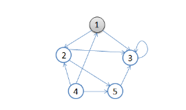

如图，从顶点1开始做深度搜索：

初始状态，从顶点1开始
依次访问过顶点1,2,3后，终止于顶点3
从顶点3回溯到顶点2，继续访问顶点5，并且终止于顶点5
从顶点5回溯到顶点2，并且终止于顶点2
从顶点2回溯到顶点1，并终止于顶点1
从顶点4开始访问，并终止于顶点4


#### [广度优先算法（bfs）](./data_structures/graphs/bfs.c)

广度优先搜索（也称宽度优先搜索）是连通图的一种遍历算法，也是很多重要的图的算法的原型。Dijkstra单源最短路径算法和Prim最小生成树算法都采用了和广度优先搜索类似的思想。属于一种盲目搜寻法，目的是系统地展开并检查图中的所有节点，以找寻结果。换句话说，它并不考虑结果的可能位置，彻底地搜索整张图，直到找到结果为止。基本过程，BFS是从根节点开始，沿着树(图)的宽度遍历树(图)的节点。如果所有节点均被访问，则算法中止。一般用队列数据结构来辅助实现BFS算法。


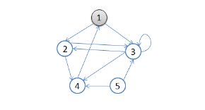
如图，从顶点1开始进行广度优先搜索：

初始状态，从顶点1开始，队列={1}
访问1的邻接顶点，1出队变黑，2,3入队，队列={2,3,}
访问2的邻接结点，2出队，4入队，队列={3,4}
访问3的邻接结点，3出队，队列={4}
访问4的邻接结点，4出队，队列={ 空}
结点5对于1来说不可达。


DFS
非递归：
1.利用栈实现
2.从源节点开始把节点按照深度放入栈，然后弹出
3.每弹出一个点，把该节点下一个没有进过栈的邻接点放入栈
4.直到栈为空

BFS
1.利用队列实现
2.从源节点开始依次按照宽度进队列，然后弹出
3.每弹出一个节点，就把该节点所有没有进过队列的邻接点放入队列
4.直到队列为空


#### [强连通分量](./data_structures/graphs/strongly_connected_components.c)
强连通分量（Strongly Connected Components, SCC）是指有向图中的一些极大顶点集合，其中任意两个顶点都可以互相到达。

求解有向图的强连通分量问题是一个经典的图论问题，具有广泛的应用。一种常用的算法是基于深度优先搜索和反向图的思想，具体步骤如下：

使用DFS对原图进行遍历，记录每个顶点遍历完成的时间戳，并按照时间戳的逆序排列顶点。

对原图进行反向操作，得到反向图，即将所有有向边的方向反转。

从第一步中排序后的顶点出发，在反向图上进行深度优先搜索，得到反向图中的强连通分量。

以下是使用C语言实现求解有向图的强连通分量的代码示例：
```c
#define MAX_VERTICES 1000

int graph[MAX_VERTICES][MAX_VERTICES];
int visited[MAX_VERTICES];

int n;
int t;    // 时间戳，记录DFS完成的时间
int order[MAX_VERTICES];   // 记录顶点遍历完成的时间戳，按照逆序排列

void dfs(int v) {
    visited[v] = 1;
    for (int i = 0; i < n; i++) {
        if (graph[v][i] && !visited[i]) {
            dfs(i);
        }
    }
    order[--t] = v;   // 记录顶点遍历完成的时间戳
}

void dfs_reverse(int v) {
    visited[v] = 1;
    printf("%d ", v);   // 输出当前强连通分量中的顶点
    for (int i = 0; i < n; i++) {
        if (graph[i][v] && !visited[i]) {
            dfs_reverse(i);
        }
    }
}

void scc() {
    memset(visited, 0, sizeof(visited));
    t = n;
    for (int i = 0; i < n; i++) {
        if (!visited[i]) {
            dfs(i);
        }
    }
    memset(visited, 0, sizeof(visited));
    for (int i = 0; i < n; i++) {
        int v = order[i];
        if (!visited[v]) {
            printf("SCC: ");
            dfs_reverse(v);
            printf("\n");
        }
    }
}

```
在代码中，我们使用邻接矩阵存储有向图，其中graph[i][j]表示是否存在从i到j的有向边。使用visited数组来记录每个顶点是否已经被访问过。在dfs()函数中，我们对原图进行DFS遍历，并记录每个顶点遍历完成的时间戳。在scc()函数中，我们按照时间戳的逆序对顶点进行遍历，并在反向图上执行DFS，得到强连通分量。

该算法的时间复杂度为O(V+E)，其中V和E分别表示图中顶点和边的数量。由于需要对图进行两次DFS遍历，因此效率不高，但它是一种通用的算法，可以处理任意形态的有向图，并且输出结果具有直观性，便于人们理解。

#### [拓扑排序](./data_structures/graphs/topological_sort.c)
拓扑排序（Topological Sort）是一种对有向无环图（DAG）进行排序的算法。具体来说，如果存在一条从顶点u到顶点v的路径，那么在排序中顶点u会排在顶点v的前面。拓扑排序可以用来检测有向图中是否存在环，以及确定任务或变量之间的依赖关系。

以下是使用C语言实现拓扑排序的代码示例：
```c
#define MAX_VERTICES 1000

int graph[MAX_VERTICES][MAX_VERTICES];
int in_degree[MAX_VERTICES];

int n;

void topological_sort() {
    queue<int> q;
    for (int i = 0; i < n; i++) {
        if (in_degree[i] == 0) {
            q.push(i);
        }
    }
    while (!q.empty()) {
        int u = q.front();
        q.pop();
        printf("%d ", u);   // 输出当前节点
        for (int v = 0; v < n; v++) {
            if (graph[u][v]) {
                in_degree[v]--;
                if (in_degree[v] == 0) {
                    q.push(v);
                }
            }
        }
    }
}

int main() {
    memset(in_degree, 0, sizeof(in_degree));
    // ... 构建有向图 ...
    topological_sort();
    return 0;
}

```
在代码中，我们使用邻接矩阵存储有向图，其中graph[i][j]表示是否存在从i到j的有向边。使用in_degree数组记录每个顶点的入度，即有多少个顶点指向该顶点。在topological_sort()函数中，我们首先将所有入度为0的节点加入队列中，然后依次从队列中弹出节点，并更新与其邻接的节点的入度。如果更新后某个节点的入度变为0，则将其加入队列中。最终输出的顺序即为拓扑排序的结果。

该算法的时间复杂度为O(V+E)，其中V和E分别表示图中顶点和边的数量。该算法具有良好的效率和适用性，可以处理任意形态的有向无环图。同时，由于输出结果具有直观性，因此在实际应用中被广泛采用。


#### [传递闭包](./data_structures/graphs/transitive_closure.c)
传递闭包（Transitive Closure）是指在有向图中，对于任意两个节点u和v，如果存在一条从u到v的路径，那么就认为(u, v)这条边满足传递性。

求解传递闭包问题可以使用Floyd算法，其基本思想是通过动态规划的方式计算出每对顶点之间的最短路径。具体来说，假设d[i][j]表示i到j的最短路径长度，那么当且仅当存在一条从i到j的路径时，d[i][j]才为1。通过迭代更新d[i][j]的值，即可得到图的传递闭包。

以下是使用C语言实现Floyd算法求解传递闭包的代码示例：
```c
#define MAX_VERTICES 1000

int graph[MAX_VERTICES][MAX_VERTICES];
int closure[MAX_VERTICES][MAX_VERTICES];

int n;

void transitive_closure() {
    memcpy(closure, graph, sizeof(graph));   // 初始化传递闭包
    for (int k = 0; k < n; k++) {
        for (int i = 0; i < n; i++) {
            for (int j = 0; j < n; j++) {
                if (closure[i][k] && closure[k][j]) {
                    closure[i][j] = 1;
                }
            }
        }
    }
}

int main() {
    // ... 构建有向图 ...
    transitive_closure();
    // ... 输出传递闭包 ...
    return 0;
}

```
在代码中，我们使用邻接矩阵存储有向图，其中graph[i][j]表示是否存在从i到j的有向边。使用closure数组记录传递闭包，其初始值为邻接矩阵。在transitive_closure()函数中，我们使用三重循环对所有顶点进行遍历，并根据已知的最短路径计算新的路径长度。如果发现(i, k)和(k, j)两条边都在传递闭包中，则将(i, j)这条边也加入其中。

该算法的时间复杂度为O(N^3)，其中N表示图中顶点的数量。由于需要对每个顶点对进行遍历，因此效率不高，但它是一种通用的算法，可以处理任意形态的有向图，并且输出结果具有直观性，便于人们理解。


### [链表](./data_structures/linked_list/)

链表（Linked List）是一种常见的数据结构，用于存储一系列动态分配的元素。相比于数组，链表具有更好的动态性和扩展性，可以在任意位置高效地插入和删除元素。

在C语言中，链表通常使用结构体和指针来实现。每个节点（Node）由一个结构体表示，其中包含一个存储数据元素的字段和一个指向下一个节点的指针字段。一个链表就是由若干个这样的节点通过指针连接而成的数据结构。

可以通过动态内存分配函数malloc()来创建新的节点，并使用free()函数释放不再需要的节点。通过使用指针来操作链表，可以高效地对链表进行查找、插入和删除等操作。但是，由于链表中的节点不是连续存储的，因此访问任意位置的元素需要遍历整个链表，导致链表的查找效率较低。

### [哈希集合](./data_structures/hash_set/)

哈希集合是一种基于哈希表实现的集合数据结构。它的特点是可以快速地添加、删除和查找元素，时间复杂度通常为O(1)。与列表或树型集合不同，哈希集合中元素的存储位置不取决于元素在集合中的序号，而是根据元素的散列值来确定。

非线性容器，数据的存放位置不固定

数据不可重复，数据在集合中是唯一不可重复的

增删改查（特别是查找）效率非常高，HashSet是以空间换时间

HashSet的结构如下，左边的List称为桶，其实是一个数组，数组的每一项都是一个链表，数据的增删查改都围绕着一种HashCode（哈希密码算法）进行，本例程中使用了最基本的求余运算

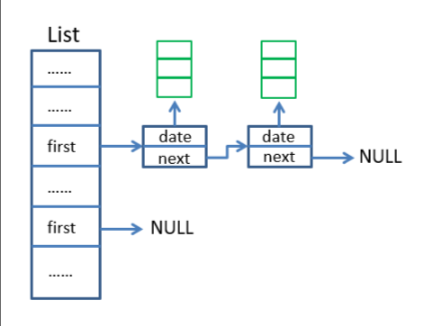

### [向量](./data_structures/vector.c)
vector称为动态数组或可变长数组，是一种可以在其尾部添加或删除元素的序列容器。它提供了与静态数组类似的随机访问性能，并且可以在需要时自动调整大小。

向量的实现方法是使用连续的内存空间来存储元素，并维护一个指针(或迭代器)指向向量的末尾。当向量中没有足够的空间来存储新元素时，需要申请更多的内存空间，并将原有元素复制到新空间中。此外，当从向量中删除元素时，也需要将剩余元素向前移动，以保持连续的内存布局。

向量支持常规的数组操作，例如：根据索引访问元素、修改元素、添加元素、删除元素以及获取向量的大小和容量等。由于向量的底层实现是连续的内存块，因此在处理大量元素时，它比链表等非连续数据结构具有更好的缓存性能。

向量的优点是易于使用，提供了高效的随机访问性能，可以在需要时动态调整大小，同时还支持许多与数组相关的操作。缺点是在插入和删除元素时可能会导致整个向量的重新分配和元素移动，这可能会导致一些性能瓶颈。此外，在插入和删除元素时需要将数组中的元素向前或向后移动，因此操作的时间复杂度为O(n)。


## 开发者工具

### [内存泄漏检查](./developer_tools/)

该文件包含malloc_dbg、calloc_dbg、free_dbg和printLeaks实现。

这些函数将跟踪内存分配和释放。

```c
#include <stdio.h> /// For IO operations if needed.
#include <stdlib.h> /// For the EXIT_SUCCESS macro and the "real" malloc, calloc and free functions.
#include "malloc_dbg.h" /// For the macros malloc, calloc and free and the malloc_dbg, calloc_dbg and free_dbg functions.

#undef malloc
#undef calloc
#undef free

#define malloc(bytes) malloc_dbg(bytes, __LINE__, __FILE__, __FUNCTION__)

#define calloc(elemCount, elemSize) calloc_dbg(elemCount, elemSize, __LINE__, __FILE__, __FUNCTION__)

#define free(ptr) free_dbg(ptr)

int main(int argc, char* argv[])
{
	int* iptr = malloc(10 * sizeof(int));
	char* cptr = calloc(256, sizeof(char));

	free(iptr);
	// free(cptr);

	return 0;
}

```

## 动态规划

动态规划（Dynamic Programming，DP）是一种求解最优化问题的算法思想，它通过将原问题分解成若干个子问题来降低问题的复杂度，并利用已经求解过的子问题的最优解来推导出原问题的最优解。

动态规划可以用于解决许多不同类型的问题，例如背包问题、最长公共子序列问题、编辑距离问题等等。通常，使用动态规划求解问题需要满足以下两个条件：

问题具有最优子结构性质：即问题的最优解可以由其子问题的最优解组合而成。

问题存在重叠子问题性质：即问题的子问题在求解过程中会被重复计算。

基于以上两点，我们可以使用动态规划的思想来设计算法，提高效率和准确性。通常，动态规划的求解过程可以分为三个步骤：

定义状态：将原问题转化为子问题，并定义状态表示子问题的解。

状态转移方程：根据子问题之间的关系，设计递推式或者递归式，求出每个子问题的最优解。

计算最终结果：计算原问题的最优解，通常是根据所有子问题的最优解得到的。

动态规划算法通常可以通过备忘录法（Memoization）或者自底向上的迭代方式来实现。它具有优秀的时间复杂度和空间复杂度，可以有效地解决许多复杂的最优化问题。

### [最长公共子序列问题（LCS）](./dynamic_programming/lcs.c)

LCS 问题的算法用途广泛：

如在软件不同版本的管理中，用 LCS 算法找到新旧版本的异同处;

在软件测试中，用 LCS 算法对录制和回放的序列进行比较，在基因工程领域，用 LCS 算法检查患者 DNA 连与键康 DNA 链的异同;

在防抄袭系统中，用 LCS 算法检查论文的抄袭率。LCS 算法也可以用于程序代码相似度度量，人体运行的序列检索，视频段匹配等方面，

所以对 LCS 算法进行研究具有很高的应用价值。动态规划思想，把大问题分解成若干小问题，用矩阵记录状态结果。


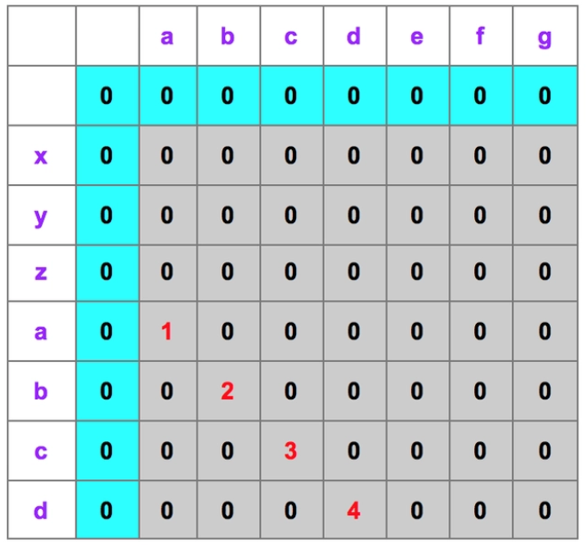

```
var str1="abcdefg";var str2="xyzabcd";

当input1[i] == input2[j]时，dp[i][j]=dp[i-1][j-1]+1。

当input1[i] != input2[j]时，dp[i][j] = 0。

```

### [矩阵链排序问题](./dynamic_programming/matrix_chain_order.c)

给定n个矩阵的链<A1,A2,...,An>，其中，Ai和Ai+1是可乘的，（ 矩阵Ai的规模为p(i-1)×p(i) (1<=i<=n) ）

求完全括号化方案，使得计算乘积A1A2...An所需标量乘法次数最少。

首先定义m[i,j]：定义为矩阵Ai*A(i+1)*...*Aj所需乘法代价最小的次数。


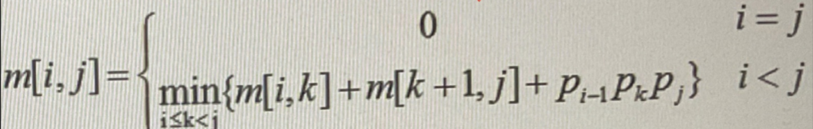


## [贪心算法](./greedy_approach/)
贪心算法（Greedy Approach）是一种求解最优化问题的算法思想，它通过每一步选择当前状态下最优策略来达到全局最优的结果。

贪心算法通常适用于满足贪心选择性质和最优子结构性质的问题。贪心选择性质是指在每一步选择中，都采取当前最优的选择，即局部最优解；最优子结构性质是指问题的最优解可以由其子问题的最优解推导出来。

贪心算法的基本流程如下：

1、确定问题的贪心选择方式。

2、利用贪心选择方式，将原问题转化为一个规模更小的子问题。

3、重复应用1和2，直到得到问题的完整解。

需要注意的是，贪心算法不一定能够得到问题的全局最优解，因为贪心选择的结果可能会对后续的选择造成限制。因此，在使用贪心算法时，需要仔细分析问题的特点和限制，确定适合的贪心选择策略，并进行正确的验证和优化。

贪心算法具有简单、高效、易实现等优点，适用于处理许多实际问题，例如背包问题、活动安排问题、霍夫曼编码问题等等。

### [dijkstra算法](./greedy_approach/dijkstra.c)

Dijkstra 算法是一个基于「贪心」、「广度优先搜索」、「动态规划」求一个图中一个点到其他所有点的最短路径的算法，时间复杂度 O(n2)

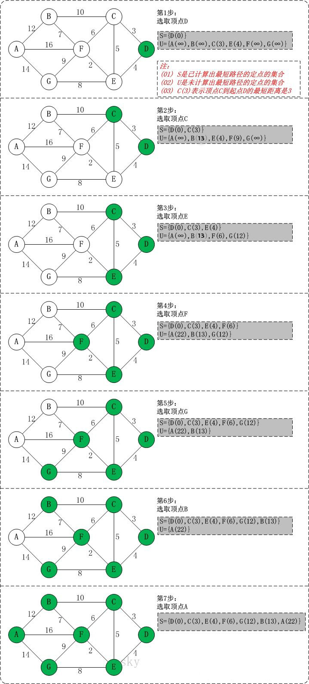


### [prims算法](./greedy_approach/prim.c)

普里姆算法查找最小生成树的过程，采用了贪心算法的思想。对于包含 N 个顶点的连通网，普里姆算法每次从连通网中找出一个权值最小的边，这样的操作重复 N-1 次，由 N-1 条权值最小的边组成的生成树就是最小生成树。

那么，如何找出 N-1 条权值最小的边呢？普里姆算法的实现思路是：

1、将连通网中的所有顶点分为两类（假设为 A 类和 B 类）。初始状态下，所有顶点位于 B 类；

2、选择任意一个顶点，将其从 B 类移动到 A 类；

3、从 B 类的所有顶点出发，找出一条连接着 A 类中的某个顶点且权值最小的边，将此边连接着的 A 类中的顶点移动到 B 类；
重复执行第 3  步，直至 B 类中的所有顶点全部移动到 A 类，恰好可以找到 N-1 条边。


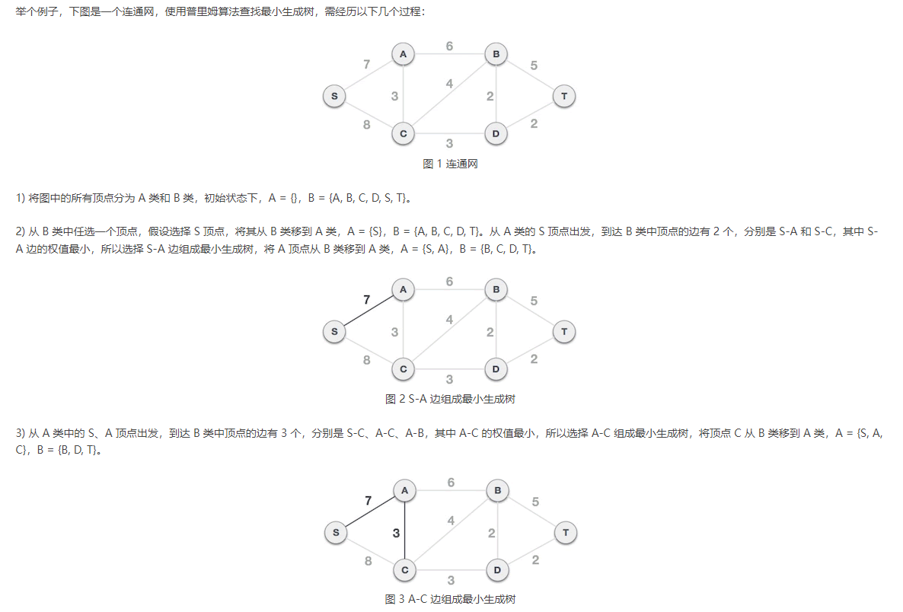

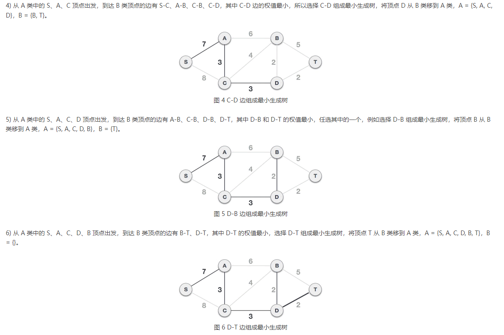

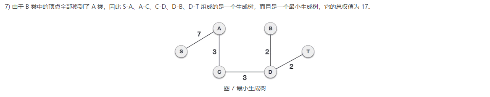

## [进程调度算法](./process_scheduling_algorithms/)


## [搜索算法](./searching/)


## [排序算法](./sorting/)


## [哈希](./hash/)

### [Adler32](./hash/hash_adler32.c)

Adler-32通过求解两个16位的数值A、B实现，并将结果连结成一个32位整数.

A就是字符串中每个字节的和，而B是A在相加时每一步的阶段值之和。在Adler-32开始运行时，A初始化为1，B初始化为0，最后的校验和要模上65521(小于2的16次方的最小素数)。

### [Blake2b](./hash/hash_blake2b.c)

Blake2b加密散列函数为加密应用程序中使用的数据提供了足够安全的散列。

它被设计为在64位平台上执行最佳性能。对于长度为128位的消息，该算法可以输出长度为1到64字节的摘要。

对于长度不超过64字节的键也支持键哈希。

### [CRC32](./hash/hash_crc32.c)

CRC为校验和的一种，是两个字节数据流采用二进制除法（没有进位，使用XOR来代替减法）相除所得到的余数。

其中被除数是需要计算校验和的信息数据流的二进制表示；除数是一个长度为 n + 1 的预定义（短）的二进制数，通常用多项式的系数来表示。在做除法之前，要在信息数据之后先加上 n 个0。

对于 crc32 来说，IEEE 标准下的除数是 0xedb88320。除法运算效率比较低，所以生产环境一般使用的是查表法。

### [Djb2](./hash/hash_djb2.c)

djb2是一个产生随机分布的的哈希函数。

以下是 djb2 的哈希函数：

X = (a * X) + c; // "mod M", M = 2^32 或 2^64

### [Sdbm](./hash/hash_sdbm.c)

SDBM提供了一个简单的基于文件的键值存储，它只能存储String键和值。

### [8-bit XOR](./hash/hash_xor8.c)

XOR运算能够使二进制值0和1进行相对平均的分布。


## [数学](./math/)


## [几何学](./geometry/)

几何学（Geometry）是研究空间和形状的数学分支。它主要研究点、线、面、体等基本几何图形的性质和关系，以及它们之间的变换和运动。几何学不仅是一门理论学科，还被广泛应用于物理学、工程学、计算机图形学等领域。

在几何学中，我们通常使用坐标系来表示点、向量和其他几何对象。通过向量的加减、点积和叉积等运算，可以得到许多有用的几何信息，例如长度、角度、曲率等等。同时，我们也可以使用向量和矩阵等工具来进行几何变换，例如平移、旋转、缩放和投影等等。

几何学的应用领域非常广泛。在工程学中，几何学被用于设计建筑、机械和电路等物品；在计算机图形学中，几何学则是渲染和模拟三维场景所必须的基础；在物理学中，几何学则被用于描述空间和时间的关系，以及各种粒子和场的运动状态。

总之，几何学是一门重要的数学分支，对于我们理解空间和形状有着至关重要的作用，同时也对许多实际应用产生了深远的影响。

### [四元数](./geometry/quaternions.c)

四元数（以后不特指四元数=单位四元数）是四维空间中一个超球上面的点，满足w²+x²+y²+z²=1；而纯四元数是四维空间在w=0时的一个子空间的点，形式为{0, q}，特别注意的是纯四元数与四元数是不同的概念。

四元数是复数虚部扩展的结果，复数的虚部为1个，而四元数虚部有3个，且两两互相正交，其中实部是cosθ/2，而虚部为一个単位轴乘以sinθ/2。

四元数自由度并没有四个维度，由于存在w²+x²+y²+z²=1这个约束，它的自由度其实只有3，且每个四元数可以对应一个特征向量，即n。但请记住四元数并不是与特征向量一一对应的，后文会有说。

由于四元数存在于四维空间，所以如何利用低维信息去理解高维信息就显得尤为重要。我们这里先用三维举个例子，三维的球用代数表示为x²+y²+z²=1，虽然球上面的点是由x，y，z三个参数来确定，但实际上我们只需要两个。假设取x和z表示，其中y可以通过x和z进行求解。那么，我们将y轴信息给隐去，只看投影平面，如下图所示。这张图的意思是，整个球在XOZ平面上投影是一个圆，当球面一点投影在圆上时，y=0；投影的位置位于圆内时，则分别两种情况，y>0处于北半球，y<0处于南半球。所以我们仅通过投影后的圆即可还原出整个球体。

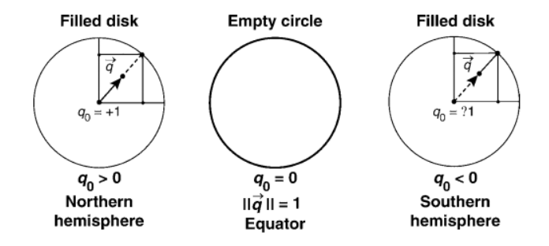

让我们推广到四维，w²+x²+y²+z²=1中取x、y和z来表示超球。如下图所示，四维空间投影到三维超平面（w=0）可能是一个two-sphere。当投影点在整个two-sphere的边缘时，w一定为0，值得一提的是在这个空间内的四元数是一个纯四元数。当投影点落在two-sphere的内部时，也分为两种情况，w>0和w<0。但是我们可以发现这两种情况下对应的特征向量是一样的，所以我们将旋转矩阵向四元数转换时，是有两个对应值的，四元数的范围是2倍覆盖于3D旋转（2:1 mapping）。

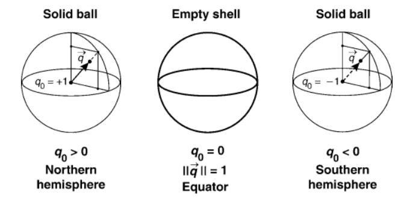

### [空间中三维矢量](./geometry/vectors_3d.c)


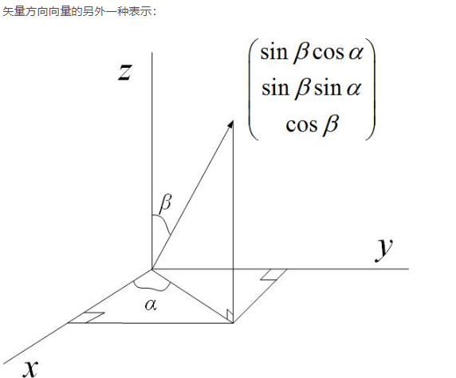


## [图形](./graphics/spirograph.c)

使用到openGL库

## [数值方法](./numerical_methods/)


## [机器学习](./machine_learning/)

机器学习是让计算机像人类一样学习和行动的科学，通过以观察和现实世界互动的形式向他们提供数据和信息，以自主的方式改善他们的学习。


## [其他](./misc/)


## [数学和计算机科学问题集锦](./project_euler/)

该项目得名于瑞士数学家Leonhard Euler（1707-1783），他被认为是最伟大的数学家之一，创造了许多重要的数学理论和方法。Project Euler欢迎所有人参与，任何人都可以通过网站注册账号并开始解答问题。每个问题都涉及一些数学知识和编程技巧，需要用代码实现求解。

该项目的目标不仅是为程序员提供一个有趣的挑战，还希望通过这些问题鼓励人们对数学和计算机科学的兴趣，并促进人们的学习和成长。

## [在线编程平台](./exercism/)

Exercism是一个在线的编程练习平台，旨在帮助人们通过完成各种编程练习来提高自己的编程技能。该平台提供了许多有趣和挑战性的练习题，涵盖了多种编程语言和主题。

Exercism的工作方式类似于迭代式的编程练习。首先，用户需要从练习库中选择一项练习题，并下载相应的测试套件和示例代码。然后，用户可以根据自己的理解和能力编写代码，以满足测试套件的所有要求。一旦达到要求，用户可以将自己的代码提交给社区进行审核和反馈。其他用户会对代码进行评论和改进建议，从而帮助用户进一步完善自己的代码。

Exercism的目标不仅是提高用户的编程技能，还希望通过开放和协作的方式促进人们的学习和成长。用户可以与其他程序员交流和分享自己的经验，获得社区的支持和鼓励。同时，Exercism也鼓励用户参与到项目的开发和维护中，为其他人提供更好的学习体验。

### [hello-world](./exercism/hello_world/hello_world.c)

```c
const char *hello(void)
{
    char *ans = strdup("Hello, World!");
    /* string is pointer of the first character */
    return ans;
}
```

### [检查字符串是否为 Isogram](./exercism/isogram//isogram.c)

 Isogram 是一个单词中的字母不超过一次

```c
bool is_isogram(const char phrase[])
{
    /* use 'unsigned' because of the function strlen(...) */
    unsigned int i = 0;
    unsigned int j = 0;

    /* the current read character in the first for-loop */
    char current_char = ' ';

    /* return status */
    bool status = true;

    /* contains the length of the given string */
    unsigned int len_phrase = strlen(phrase);

    for (i = 0; i < len_phrase; i++)
    {
        current_char = phrase[i];

        /* makes sure the current character has no repetition */
        for (j = i + 1; j < len_phrase; j++)
        {
            if (current_char == phrase[j])
            {
                status = false;

                /*
                    because the given string is none isogram.
                    that means we can exit the nested for-loop.
                */
                goto end;
            }
        }
    }

/* exit label */
end:
    return status;
}
```

### [缩写词](./exercism/acronym/acronym.c)


### [单词数目](./exercism/word_count/word_count.c)


### [RNA重组](./exercism/rna_transcription/rna_transcription.c)
```c
char *to_rna(const char s[])
{
    /* determines the length of the given string */
    int len = strlen(s);

    /* creates a return string */
    char *ans = malloc(sizeof(char) * len);

    /* for the loop */
    int i = 0;

    /* actual compile process */
    for (i = 0; i < len; i++)
    {
        switch (s[i])
        {
        case 'G':
            ans[i] = 'C';
            break;
        case 'C':
            ans[i] = 'G';
            break;
        case 'T':
            ans[i] = 'A';
            break;
        case 'A':
            ans[i] = 'U';
            break;
        }
    }

    return ans;
}
```