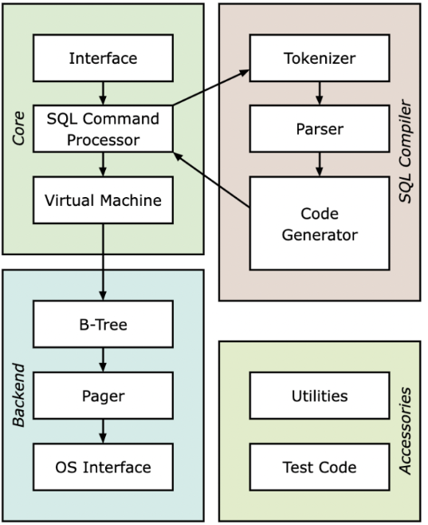

## C++实现简单数据库

### 前言
数据库是“按照数据结构来组织、存储和管理数据的仓库”。是一个长期存储在计算机内的、有组织的、可共享的、统一管理的大量数据的集合。

使用者可以对其中的资料执行新增、选取、更新、刪除等操作。

SQL (Structured Query Language:结构化查询语言) 是一种特定目的程式语言，用于管理关系数据库管理系统 (RDBMS)，或在关系流数据管理系统 (RDSMS) 中进行流处理。

关系数据库管理系统就是管理关系数据库，并将数据逻辑组织的系统。

### 架构



### 程序初始源码
```cpp
#include <iostream>

class DB {
public:
    void print_prompt();
    bool parse_meta_command(std::string command);
    void start();
};


void DB::print_prompt()
{
    std::cout << "db > ";
}


bool DB::parse_meta_command(std::string command)
{
    if (command == ".exit")
    {
        std::cout << "Bye!" << std::endl;
        exit(EXIT_SUCCESS);
    }
    else
    {
        std::cout << "Unrecognized command: " << command << std::endl;
        return true;
    }
    return false;
}


void DB::start()
{
    while (true)
    {
        print_prompt();
        
        std::string input_line;
        std::getline(std::cin, input_line);


        if (parse_meta_command(input_line))
        {
            continue;
        }
    }
}


int main()
{
    DB db;
    db.start();
    return 0;
}

```
> 编译：g++ db.cpp -o db --std=c++11

### ruby测试初始脚本
```ruby
describe 'database' do
  def run_script(commands)
    raw_output = nil
    IO.popen("./db", "r+") do |pipe|
      commands.each do |command|
        pipe.puts command
      end


      pipe.close_write


      # Read entire output
      raw_output = pipe.gets(nil)
    end
    raw_output.split("\n")
end


  it 'test exit and unrecognized command' do
    result = run_script([
      "hello world",
      "HELLO WORLD",
      ".exit",
    ])
    expect(result).to match_array([
      "db > Unrecognized command: hello world",
      "db > Unrecognized command: HELLO WORLD",
      "db > Bye!",
    ])
  end
end

```
> 使用方法：rspec db_test.rb

#### 安装ruby

* 检查我们是否有安装ruby。
输入命令ruby -v，我们将得到
ruby 2.7.0p0 (2019-12-25 revision 647ee6f091) [x86_64-linux-gnu]
如果没有安装使用sudo apt install ruby或对应操作系统的包管理工具安装即可。
* 检查我们是否有安装rspec
输入命令rspec -v，我们将得到
RSpec 3.10
  - rspec-core 3.10.2
  - rspec-expectations 3.10.2
  - rspec-mocks 3.10.3
  - rspec-support 3.10.3
同理如果没有安装则使用sudo gem install rspec安装即可。若提示没有gem则使用sudo apt install gem便可完成安装。
ruby和rspec版本基本未对本单元测试造成影响，如果存在问题，可提出。
至此我们的测试环境便已经安装完成了。